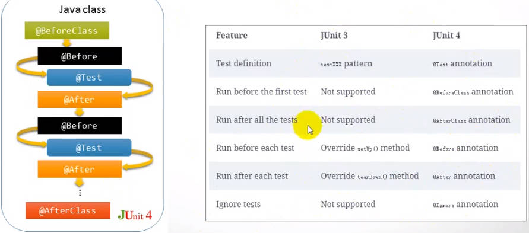

## Junit4概述

   - 在2006年，发布Junit4.0
#### 1、Junit4和Junit3的主要特性区别
   
   - 不需要继承TestCase基类
   - 不需要强制方法名以test开始
   
#### 2、Junit4扩展特性
   - Runner管理测试生命周期（BlockJunit4ClassRunner）
   - Rule（junit4.7及以后的版本）
   
#### 3、发起Junit4测试的方法
   - @Test注解
   - @RunWith + @Suite.SuiteClasses
     - 执行顺序不符合预期
     - setUp -> test -> tearDown -> destroy -> init
     
#### 4、DDT（Data Driver Test）
   - @Parameterized
     - 使用@RunWith(Parameterized.class)
     - 定义成员属性作为测试参数，使用@Parameterized.Parameter(index)修饰
     - 定义静态方法，构造测试输入输出参数，使用@Parameterized.Parameters(name = "xxx")修饰，其中name是每一组参数对应的测试用例名
   - @Theories
     - @DataPoint定义单次测试的输入
     - @DataPoints定义输入集合
     - @Theory代替@Test的注解
     
#### 5、Junit4测试框架的问题
   - RunWith扩展受限
     - @RunWith只能接入一个扩展
       - junit4.7版本引入了Rule机制解决以上问题
   
   - 自定义Runner
   
   - 自定义Rule