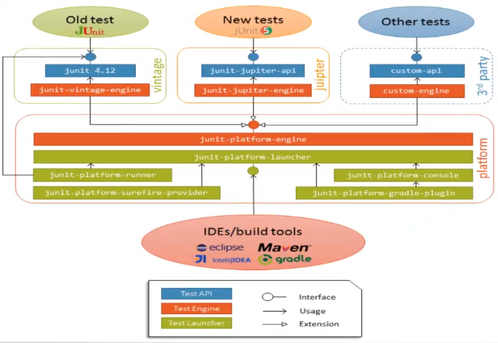

## Junit5概述

#### 背景
   - Junit5和Junit3/Junit4的关系
        - Junit5并非是Junit3和Junit4的升级
        - Junit4兼容Junit4(提供引擎)
   - Junit4的问题
        - monolithic：扩展、三方件、工具等全部耦合在一个jar包
        - 社区没有实际的负责人，更新速度缓慢
        - 一个测试类只能声明一个Runner
        - Runner和Rule(4.7及以后版本)都是作用于类级别，不能单独作用于方法级别
        
#### Junit5特点
   - 2015年孵化，2017年正式发布
   - Modularization：JDK9
   - API segregation
   - Compatibility with older releases
   - Modern programming model  
   
#### Junit5组成
   
   - Platform
     - 在JVM上启动测试框架（驱动测试引擎/发现单元测试代码）
     - junit-platform-launcher：提供在Junit平台内发现测试的能力，供IDE（IDEA/Eclipse）、构建工具（Maven/Gradle）等客户端实现
        - junit-platform-runner
        - junit-platform-surefire-provider
        - junit-platform-console
        - junit-platform-gradle-plugin
     - junit-platform-engine：提供在Junit平台执行测试的能力
   - Jupiter
     - 包含Junit5的编程模型和扩展机制(SDK/API)，Jupiter也是基于Junit Platform的引擎实现
   - Vintage
     - 兼容Junit3和Junit4版本的测试引擎    
  